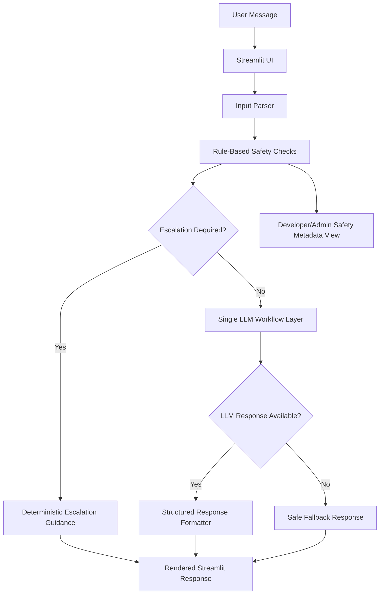

# Maseru Health AI

A modular AI healthcare support prototype exploring rule-based escalation, structured
LLM workflows, and safety-aware response generation for low-resource environments.

Live app: [https://maseru-health-support-ai.streamlit.app/](https://maseru-health-support-ai.streamlit.app/)

## Overview

Maseru Health AI is a Streamlit-based healthcare support prototype for non-diagnostic
conversations. It organizes a chatbot-style interface into a modular AI workflow
with input parsing, rule-based safety checks, LLM-assisted guidance, structured
response formatting, fallback handling, and deployment-conscious configuration.

The project is intentionally conservative. It does not diagnose, treat, prescribe,
provide emergency response, claim clinical validation, or present itself as
production-ready.

## What the System Does

- Accepts user messages through a Streamlit chat interface.
- Extracts lightweight intent and support signals from user input.
- Runs rule-based safety checks before the LLM is called.
- Uses selected high-risk phrases and physical red-flag phrases to trigger escalation
  guidance.
- Uses an existing demonstration TF-IDF + Logistic Regression risk-screening classifier
  as part of the safety layer.
- Calls a single Google ADK + LiteLLM-backed LLM workflow when escalation is not
  required.
- Generates structured internal responses and renders user-facing guidance in chat.
- Returns a deterministic fallback response if the LLM is unavailable or fails.
- Provides a developer/admin page for inspecting parser and safety metadata.

## What the System Does Not Do

- It does not diagnose medical or mental health conditions.
- It does not prescribe medication or treatment.
- It does not replace clinicians, counselors, clinics, hospitals, or emergency services.
- It does not provide emergency response capability.
- It does not claim clinical validation.
- It is not production-ready.
- It does not implement retrieval-augmented generation.
- It does not implement multi-agent orchestration.
- It does not persist patient records or authenticated clinical workflows.

## Architecture

The project is organized as a modular Python application:

- `app/streamlit_app.py`: user-facing Streamlit chat interface.
- `app/streamlit_admin_app.py`: developer/admin safety inspection page.
- `app/triage_service.py`: workflow layer connecting parsing, safety checks, LLM calls,
  response formatting, and fallback handling.
- `app/parser.py`: lightweight intent and signal extraction.
- `app/rules.py`: rule-based safety checks and escalation decisions.
- `app/llm.py`: single LLM workflow integration through Google ADK + LiteLLM.
- `app/response_formatter.py`: structured internal response objects and user-facing
  markdown rendering.
- `app/config.py`: environment variable and Streamlit secrets handling.
- `src/`: demonstration ML utilities for preprocessing, TF-IDF feature engineering,
  classifier training, and risk scoring.
- `tests/`: standard-library tests for safety behavior, fallback behavior, and Streamlit
  secret handling.

## Architecture Diagram



## Application Flow

1. A user enters a message in the Streamlit chat interface.
2. `parse_user_input()` extracts a coarse intent such as `greeting`,
   `emotional_support`, `health_support`, or `general_support`.
3. `assess_safety()` evaluates the message with rule-based checks and the
   demonstration risk-screening classifier.
4. If selected high-risk or physical red-flag phrases are detected, the system
   returns escalation guidance without calling the LLM.
5. If escalation is not required, `MaseruLLMClient` sends a bounded prompt to the configured LLM.
6. `AssistantResponse` stores structured response fields internally.
7. The Streamlit chat renders only the user-facing guidance and `When to seek
   professional help` section.
8. If the LLM fails or the API key is missing, the app returns a safe fallback message.

## Key Features

- Modular Streamlit application structure.
- Explicit separation between UI, parsing, safety checks, LLM workflow, response
  formatting, and configuration.
- Rule-based escalation guidance before LLM generation.
- Demonstration ML risk-screening layer using TF-IDF and Logistic Regression.
- Structured internal response model with simplified chat rendering.
- Safe fallback behavior when LLM calls fail.
- Streamlit Cloud secrets support for API keys.
- Standard-library tests for safety and fallback behavior.
- Deployment-conscious README and root `application.py` entry point.

## Design Decisions

- Rule-based safety checks run before LLM generation so high-risk messages do not rely
  on generative behavior.
- Escalation guidance is deterministic and conservative.
- The LLM workflow is limited to general, non-diagnostic support guidance.
- The response formatter keeps internal structure while rendering concise chat output.
- The classifier is kept as a demonstration risk-screening component, not a clinically
  validated model.
- API keys are loaded from environment variables or Streamlit secrets, not hardcoded.
- The low-resource context is reflected in the project framing and conservative support
  flow, not in offline infrastructure.

## Tech Stack

- Python
- Streamlit
- Google ADK
- LiteLLM
- OpenAI-compatible model configuration through `OPENAI_API_KEY`
- scikit-learn
- pandas
- TF-IDF
- Logistic Regression
- python-dotenv
- unittest

## Repository Structure

```text
.
+-- app/
|   +-- __init__.py
|   +-- config.py
|   +-- llm.py
|   +-- parser.py
|   +-- response_formatter.py
|   +-- rules.py
|   +-- streamlit_admin_app.py
|   +-- streamlit_app.py
|   +-- triage_service.py
+-- data/
|   +-- generate_dataset.py
|   +-- mental_health_dataset.csv
+-- models/
|   +-- model.pkl
|   +-- vectorizer.pkl
+-- src/
|   +-- __init__.py
|   +-- classifier.py
|   +-- decision_engine.py
|   +-- feature_engineering.py
|   +-- paths.py
|   +-- preprocessing.py
|   +-- rules.py
+-- tests/
|   +-- __init__.py
|   +-- test_safety_workflow.py
+-- .gitignore
+-- application.py
+-- LICENSE
+-- requirements.txt
+-- README.md
```

## Setup Instructions

Create and activate a virtual environment:

```powershell
python -m venv .venv
.\.venv\Scripts\Activate.ps1
```

Install dependencies:

```powershell
pip install -r requirements.txt
```

## Environment Variables

For local LLM-assisted responses, configure:

```powershell
setx OPENAI_API_KEY "your_api_key_here"
```

Optional variables:

```powershell
setx MASERU_LLM_MODEL "gpt-4o-mini"
setx MASERU_APP_NAME "maseru_health_support"
```

After using `setx`, restart the terminal before running the app.

You can also create a local `.env` file:

```text
OPENAI_API_KEY=your_api_key_here
MASERU_LLM_MODEL=gpt-4o-mini
MASERU_APP_NAME=maseru_health_support
```

Do not commit `.env` files or API keys.

## How to Run Locally

Main user app:

```powershell
streamlit run application.py --server.port 8501
```

Equivalent structured entry point:

```powershell
streamlit run app/streamlit_app.py --server.port 8501
```

Developer/admin inspection app:

```powershell
streamlit run app/streamlit_admin_app.py --server.port 8502
```

Run tests:

```powershell
python -m unittest discover
```

Regenerate the demonstration dataset:

```powershell
python data/generate_dataset.py
```

Retrain the demonstration risk-screening classifier:

```powershell
python -m src.classifier
```

## Deployment Notes

Live app:

[https://maseru-health-support-ai.streamlit.app/](https://maseru-health-support-ai.streamlit.app/)

For Streamlit Cloud, use `application.py` as the main file.

Configure these as root-level Streamlit Cloud secrets:

```text
OPENAI_API_KEY = "your_api_key_here"
MASERU_LLM_MODEL = "gpt-4o-mini"
MASERU_APP_NAME = "maseru_health_support"
```

The app also supports this nested OpenAI secret format:

```text
[openai]
api_key = "your_api_key_here"
```

Without `OPENAI_API_KEY`, the app renders deterministic fallback responses.
LLM-assisted guidance will not run.

## Tests

The test suite currently covers:

- parser intent and signal extraction
- high-risk keyword escalation
- high-risk messages bypassing the LLM
- fallback behavior when the LLM fails
- Streamlit secrets being copied into `OPENAI_API_KEY`

Run:

```powershell
python -m unittest discover
```

## Current Limitations

- The classifier uses a small demonstration dataset and should not be treated as
  clinically reliable.
- Safety rules are intentionally simple and need broader review before real-world use.
- The app does not persist conversations, users, or risk assessments.
- There is no authentication or role-based access control for the developer/admin
  inspection page.
- There is no application monitoring or structured production logging.
- The app has not been clinically validated.
- The system is not production-ready and should not be used as a medical device.
- Sesotho support is limited and depends mainly on the selected response language and
  LLM behavior.
- The low-resource context is reflected in product framing; the app does not implement
  offline access, SMS services, clinic directories, or local health-system integrations.

## Roadmap

- Expand test coverage for UI launch behavior and LLM integration failures.
- Expand safety rules with expert-reviewed language and local care guidance.
- Add calibrated evaluation for the demonstration risk-screening classifier.
- Add session persistence with explicit privacy controls.
- Add admin authentication before exposing safety metadata in a deployed setting.
- Improve bilingual response quality with reviewed Sesotho content.
- Add structured application logging that avoids storing sensitive user data by default.

## Engineering Focus

- Deterministic, safety-aware workflow design before LLM generation.
- Modular AI application architecture with clear service boundaries.
- Separation of deterministic rules from generative model behavior.
- Deployment-conscious configuration through environment variables and Streamlit secrets.
- Transparent limitations for a healthcare-adjacent AI prototype.

## Portfolio Positioning

This project demonstrates AI Systems Engineering skills without overstating clinical
capability:

- modular Python architecture around a Streamlit product surface
- clear separation between deterministic safety checks and generative model behavior
- a single LLM workflow layer behind a service boundary
- deployment-conscious API key handling
- structured internal response generation with user-friendly rendering
- safety-aware fallback behavior
- tests for the highest-risk deterministic paths
- transparent limitations in a healthcare-adjacent context

The project is best understood as an applied AI engineering prototype for
non-diagnostic healthcare-support conversations, not as a clinical product.
