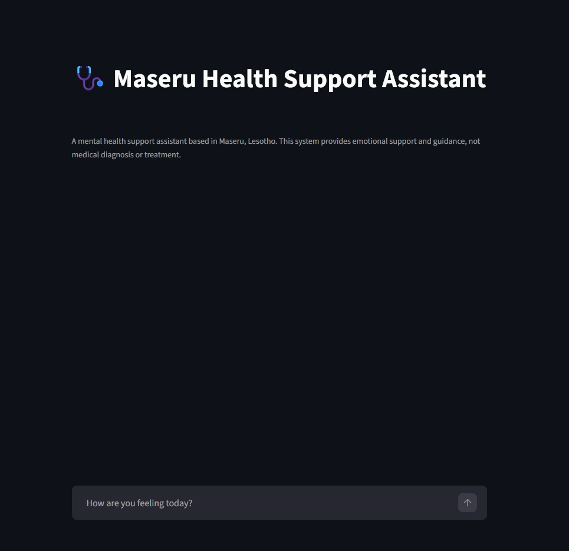
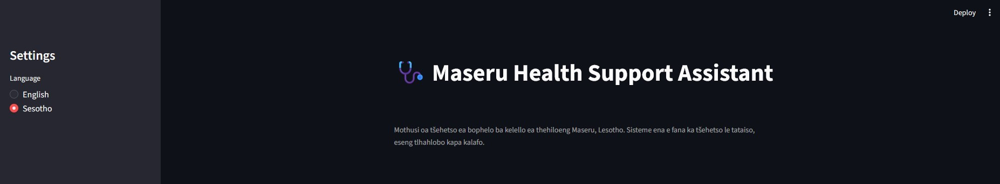

# 🩺 Maseru Health Support Assistant

A multi-agent mental health support assistant built with **Google ADK** and a **Streamlit** chat UI, localized for **Maseru, Lesotho** with an **English ↔ Sesotho** language toggle.

This project started from the DataCamp course **“Building AI Agents with Google ADK”** and was adapted from a customer-support style agent into a **mental health support** agent designed to provide:
- supportive listening
- gentle check-in questions
- general wellbeing suggestions
- a **gentle escalation banner** for urgent situations

> ⚠️ **Important:** This tool is **not** a medical device and does **not** provide medical diagnosis, treatment, or clinical advice.


---

## ✨ Features

- **Multi-agent architecture (Google ADK)**
  - Greeting agent
  - Conversation agent
  - Suggestion agent
  - Root coordinator agent
- **Streamlit chat UI**
- **Language toggle:** English / Sesotho (prompt steering)
- 


- **Gentle escalation banner** for urgent or crisis-related signals
- Model backend can be configured (OpenAI via LiteLLM, or Gemini if you choose)

---

## 🧱 Tech Stack

- Python 3.10+
- Google ADK
- Streamlit
- LiteLLM (if using OpenAI-style models)
- (Optional) Google Gemini API (if you switch to Gemini)

---

## ✅ Prerequisites

- **Python 3.10+**
- One of the following API keys (depending on your backend):

### Option A — OpenAI-style (LiteLLM)
Set your key as an environment variable:

**Windows (PowerShell)**
```powershell
setx OPENAI_API_KEY "YOUR_OPENAI_KEY"
